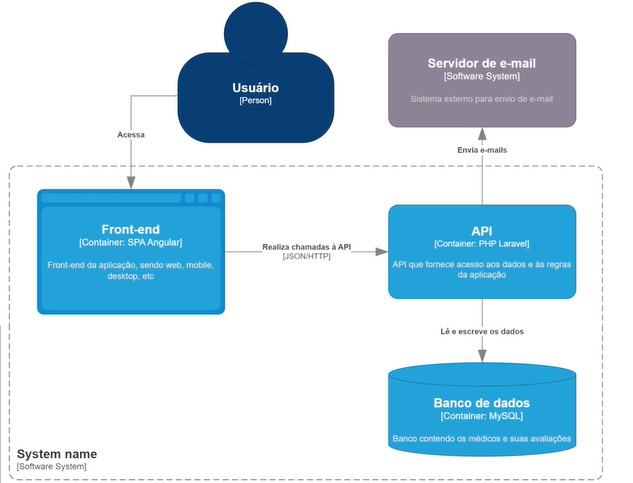
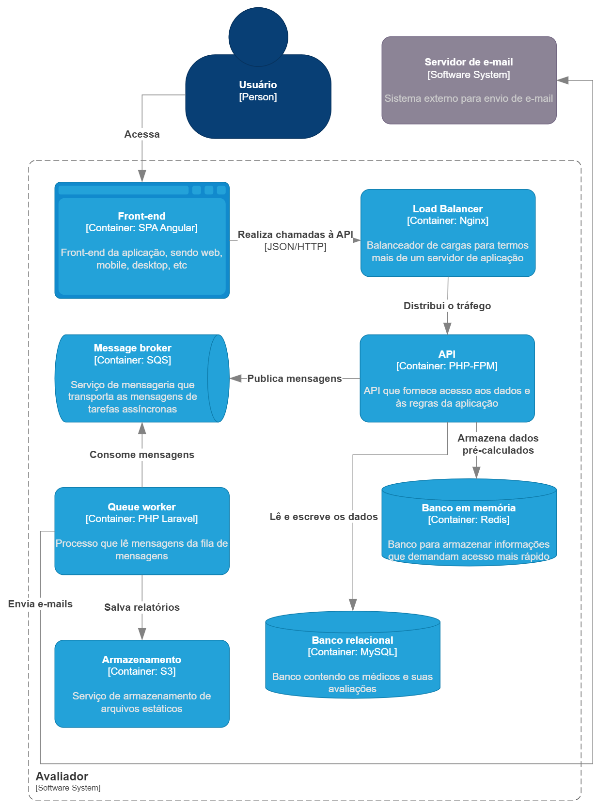

# Projeto do curso de _Arquitetura e Escalabilidade em PHP_

Nesse curso tínhamos uma aplicação legada em PHP, com bastante problemas de performance, disponibilidade etc:



E aprendemos como melhorar arquitetura dessa aplicação para que ela tenha escalabilidade

Como? Reescrevendo em Golang? Quebrando em microserviços? NÃO!

Configurando load balancer e replicando instâncias do monolito, utilizando processamento assíncrono com mensageria, 

Utilizando processamento assíncrono, cache, escalabilidade horizontal

## Problemas na arquitetura e decisões de resolução

- A request para cadastrar uma avaliação estava respondendo com muita lentidão, porque além de salvar o registro no banco
de dados, a API também estava se comunicando com um servidor externo para envio de email de maneira síncrona e bloqueante,
mas como a pessoa que está adicionando a avaliação não precisa esperar que o especialista receba o e-mail, tornamos o
envio do email assíncrono:
    
    Para resolvermos esse problema, [fizemos a classe `app/Mail/ReviewCreated.php` implementar a interface `ShouldQueue`](https://github.com/DeveloperArthur/arquitetura-escalabilidade-com-php/commit/a3d594d6939f47592857ad2c0bb72968d76b681f), essa 
interface diz pro sistema do Laravel que o email não precisa ser enviado na hora, pode ser enviado depois, vai ser 
armazenado em uma fila e depois processamos essa fila, além disso foi necessário executar 
`docker compose exec app php artisan queue:work` no terminal, para startar o Queue worker, processo que vai ler as 
mensagens da fila de mensagens
    
    O Queue Worker processa uma mensagem de cada vez, acaso a gente tenha muitas mensagens na fila, e o envio de email 
demorar, precisaríamos apenas executar `docker compose exec app php artisan queue:work` novamente, e estaríamos criando 
outro worker, escalando horizontalmente nossos processos responsáveis por ler as mensagens
  
- Fizemos um teste de carga na aplicação simulando 10 conexões simultâneas, utilizando 4 threads para enviar 
requisições em paralelo durante 10 segundos, nossa API conseguiu processar 709 requests, com média de 70 requests por 
segundo, precisávamos ser capazes de lidar com um volume maior de requests nesse período de tempo
    
    Para resolver esse problema escalamos a API horizontalmente, [colocando um load balancer na frente, e 
replicando a instância do monolito](https://github.com/DeveloperArthur/arquitetura-escalabilidade-com-php/commit/280ee6544f8c360d247143c983e3ec9f7ca2c765), após essa alteração, rodando o mesmo teste de carga e nossa arquitetura
conseguiu processar 1125 requests, com média de 112 requests por segundo, conseguimos alcançar um número maior de requests

- Escalando aplicação horizontalmente, nos deparamos com um problema na autenticação do usuário, esse sistema 
utilizava autenticação por meio de sessões, e sessões ficam salvas no servidor, como temos N instâncias de servidor, 
as sessões estavam produzindo inconsistencia no login do usuário, [fizemos uma alteração para autenticar o usuário por
meio de token, invés de sessão](), para garantir a consistência do login

  Há ainda uma outra alternativa: armazenar as sessões em um servidor externo. Isso resolve o problema de sessões com o 
balanceamento de carga também, mas traz outro componente que devemos gerenciar em nossa infraestrutura.


Solução final após todas aplicações de melhorias:



## Setup inicial

1. Após realizar o clone do projeto, instale as dependências do mesmo com:
```shell
composer install
```

2. Caso você não possua o `composer` instalado localmente:
```shell

docker run --rm -itv $(pwd):/app -w /app -u $(id -u):$(id -g) composer:2.5.8 install
```

3. Com as dependências instaladas, crie o arquivo de configuração `.env`:
```shell
cp .env.example .env
```

4. Inicie o ambiente _Docker_ executando:
```shell
docker compose up -d
```

5. Dê permissões ao usuário correto para escrever logs na aplicação
```shell
docker compose exec app chown -R www-data:www-data /app/storage
```

6. Garanta que o contêiner de banco de dados está de pé. Os logs devem exibir a mensagem _ready for connections_ nas últimas linhas
```shell
docker compose logs database
``` 
Aguarde até que o comando acima tenha como uma das últimas linhas a mensagem _ready for connections_.

7. Para criar o banco de dados, execute:
```shell
docker compose exec app php artisan migrate --seed
```

Muitos dados serão criados (1000 especialistas com 1000 avaliações cada), então essa última etapa será demorada. Enquanto ela executa, a API já estará acessível através do endereço http://localhost:8123/api. Além disso, o endereço http://localhost:8025 provê acesso ao serviço de e-mail _Mailpit_.

## Para se autenticar na aplicação:
    {
        "email": "email@example.com",
        "password": "12345678"
    }
